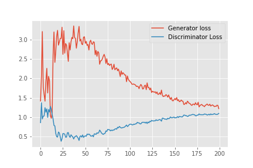

# Training-MNIST-Gan

Zhaoyu Zhang

I followed the tutorial of Generating MNIST Digit Images using Vanilla GAN with PyTorch by Sovit Ranjan Rath to generate this Generative Adversarial Network.
The aim is to create a generator that can draw digits.

To run this jupyter notebook, we need to have "input" and "output" folder at the working directory of Training "MNIST GAN.ipynb"

This is the visualisation of the output of the generator across its training stage.

And this graph shows how the losses of the generator and the discrinators decreases across their training stage.

